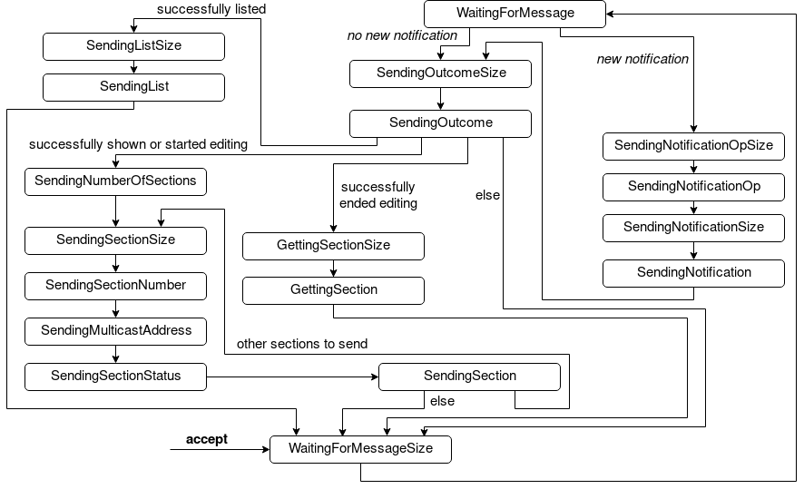

## Distributed Collaborative Editing

[](https://frontend.code-inspector.com/public/project/8053/Distributed-Collaborative-Editing/dashboard)
[](https://frontend.code-inspector.com/public/project/8053/Distributed-Collaborative-Editing/dashboard)

#### Compilazione sorgenti (Java 8)

```bash
javac *.java
```

#### Esecuzione Client e Server

```bash
java Server [host] [port_number] [RMI_port_number]
```

```bash
java Client [host] [port_number] [RMI_port_number]
```


#### Comandi disponibili 
```bash
turing --help                     visualizza questa lista di comandi
register <username> <password>    registra l'utente
login <username> <password>       effettua il login
logout                            effettua il logout
create <doc> <numsezioni>         crea un documento
share <doc> <username>            condivide il documento
show <doc> <sec>                  mostra una sezione del documento
show <doc>                        mostra l'intero documento
list                              mostra la lista dei documenti
edit <doc> <sec>                  modifica una sezione del documento
end-edit <doc> <sec>              fine modifica della sezione del doc.
send <msg>                        invia un msg sulla chat
receive                           visualizza i msg ricevuti sulla chat
editing                           stampa la sezione che si sta editando
```

#### Macchina a stati finiti Server



